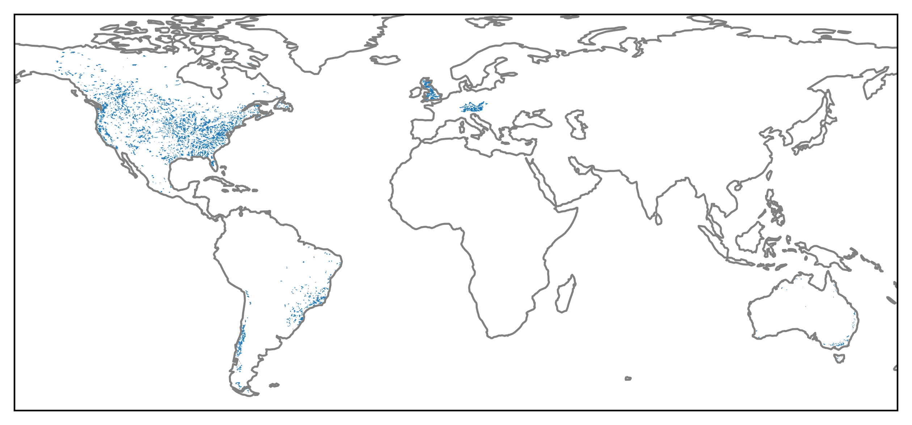

These are a series of maps containing the locations of catchments in the Caravan dataset. 
The caravan dataset is a collection of streamflow and forcing data for hydrological models.  
Caravan was prepared by [Frederik Kratzert](https://doi.org/10.1038/s41597-023-01975-w), the forcing is based on the ERA5-Land model. The streamflow is from the USGS.  
To access it easily, it was stored [here](https://doi.org/10.4121/bf0eaf7c-f2fa-46f6-b8cd-77ad939dd350.v4) on the data.4TU.nl [OPenDAP](https://data.4tu.nl/info/about-your-data/netcdf-and-opendap) server. 
This saves you from downloading and reading the whole dataset hosted on [zenodo](https://zenodo.org/records/6578598), instead only the necesarry data is downloaded and loaded into eWaterCycle as forcing for hydrological models. 
To learn more about eWaterCycle see the [website](https://ewatercycle.org) or the [docs](https://ewatercycle.readthedocs.io/en/latest/).

These maps are meant to easily explore the availible catchments and find corresponding basin_ids which are needed to generate the forcing data.. 

### Links to interactive maps per country:
[United States of America](caravan_catchments_map_United_States_of_America.html) 
[Australia](caravan_catchments_map_Australia.html) 
[Brazil](caravan_catchments_map_Brazil.html) 
[Chile](caravan_catchments_map_Chile.html) 
[Scotland](caravan_catchments_map_Scotland.html) 
[England](caravan_catchments_map_England.html) 
[Wales](caravan_catchments_map_Wales.html) 
[Canada](caravan_catchments_map_Canada.html) 
[Mexico](caravan_catchments_map_Mexico.html) 
[Germany](caravan_catchments_map_Germany.html) 
[Switzerland](caravan_catchments_map_Switzerland.html) 
[Austria](caravan_catchments_map_Austria.html) 
[Lichtenstein](caravan_catchments_map_Lichtenstein.html) 
[Czech Republic](caravan_catchments_map_Czech_Republic.html) 