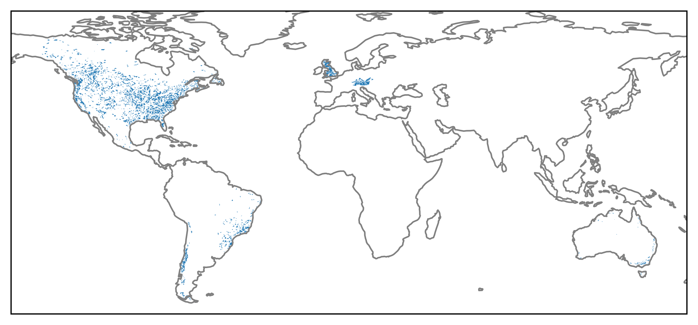
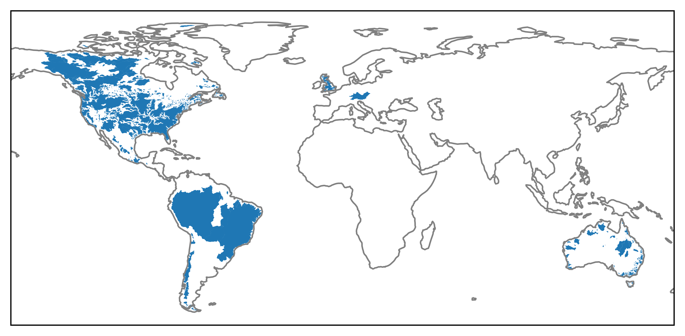

These are a series of maps containing the locations of catchments in the Caravan dataset.<br>
The caravan dataset is a collection of streamflow and forcing data for hydrological models. <br>
Caravan was prepared by [Frederik Kratzert](https://doi.org/10.1038/s41597-023-01975-w), the forcing is based on the ERA5-Land model. The streamflow is from the USGS. <br>
To access it easily, it was stored [here](https://doi.org/10.4121/bf0eaf7c-f2fa-46f6-b8cd-77ad939dd350.v4) on the data.4TU.nl [OPenDAP](https://data.4tu.nl/info/about-your-data/netcdf-and-opendap) server.<br>
This saves you from downloading and reading the whole dataset hosted on [zenodo](https://zenodo.org/records/6578598), instead only the necesarry data is downloaded and loaded into eWaterCycle as forcing for hydrological models. 
To learn more about eWaterCycle see the [website](https://ewatercycle.org) or the [docs](https://ewatercycle.readthedocs.io/en/latest/).

These maps are meant to easily explore the availible catchments and find corresponding basin_ids which are needed to generate the forcing data.. 

This is Caravan 1.0, for Caravan 1.6 scroll down


### Links to interactive maps per country:
[United States of America](caravan_catchments_map_United_States_of_America.html)<br>
[Australia](caravan_catchments_map_Australia.html)<br>
[Brazil](caravan_catchments_map_Brazil.html)<br>
[Chile](caravan_catchments_map_Chile.html)<br>
[Scotland](caravan_catchments_map_Scotland.html)<br>
[England](caravan_catchments_map_England.html)<br>
[Wales](caravan_catchments_map_Wales.html)<br>
[Canada](caravan_catchments_map_Canada.html)<br>
[Mexico](caravan_catchments_map_Mexico.html)<br>
[Germany](caravan_catchments_map_Germany.html)<br>
[Switzerland](caravan_catchments_map_Switzerland.html)<br>
[Austria](caravan_catchments_map_Austria.html)<br>
[Lichtenstein](caravan_catchments_map_Lichtenstein.html)<br>
[Czech Republic](caravan_catchments_map_Czech_Republic.html)<br>


## CARAVAN 1.6


### Links to interactive maps per country:
[Australia](v1_6/caravan_catchments_map_Australia.html)<br>
[Austria](v1_6/caravan_catchments_map_Austria.html)<br>
[Brazil](v1_6/caravan_catchments_map_Brazil.html)<br>
[Canada](v1_6/caravan_catchments_map_Canada.html)<br>
[Chile](v1_6/caravan_catchments_map_Chile.html)<br>
[Czech Republic](v1_6/caravan_catchments_map_Czech_Republic.html)<br>
[England](v1_6/caravan_catchments_map_England.html)<br>
[Germany](v1_6/caravan_catchments_map_Germany.html)<br>
[Great Britain](v1_6/caravan_catchments_map_Great_Britain.html)<br>
[Lichtenstein](v1_6/caravan_catchments_map_Lichtenstein.html)<br>
[Mexico](v1_6/caravan_catchments_map_Mexico.html)<br>
[Scotland](v1_6/caravan_catchments_map_Scotland.html)<br>
[Switzerland](v1_6/caravan_catchments_map_Switzerland.html)<br>
[United States of America](v1_6/caravan_catchments_map_United_States_of_America.html)<br>
[Wales](v1_6/caravan_catchments_map_Wales.html)<br>

To get this dataset on SRC run this in terminal:
```
export CARAVAN_CACHE=/data/shared/climate-data/caravan1_6
```

NOTE: need eWaterCycle version 2.5 for Caravan 1.6